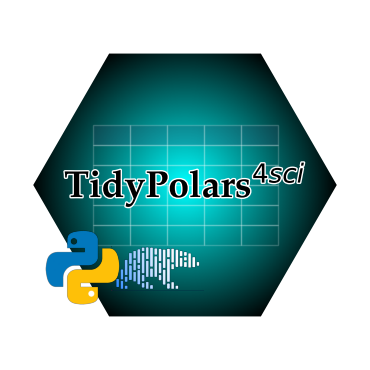

  

    <!--  -->
    
  

  
  
<h1 style="text-align:center">Combining Polars and Tidyverse for Python</h1>

  <!-- <a href="https://docs.rs/polars/latest/polars/"> -->
  <!--    -->
  <!-- </a> -->
  <!-- <a href="https://crates.io/crates/polars"> -->
  <!--    -->
  <!-- </a> -->
  
  <!-- <a href="https://doi.org/10.5281/zenodo.7697217"> -->
  <!--    -->
  <!-- </a> -->

 <!-- dprint-ignore-start -->
!!! info "Note" 
    
This site is still under construction, but full documentation can be found in package docstrings and [API Reference](api.md).

<!-- dprint-ignore-end -->

<!-- # TidyPolars $^{4sci}$ -->

<!-- 
 -->
<!--   
 -->
<!--     
 -->
<!-- <b>tidypolars4sci</b> provides functions that match as closely as possible to R's <a href="https://www.tidyverse.org/">Tidyverse</a> functions for manipulating data frames and conducting data analysis in Python using the blazingly fast <a href="https://github.com/pola-rs/polars">Polars</a> as backend.
 -->
<!-- 
The name <strong>tidypolars4sci</strong> reflects the module's main features:
 -->
<!-- <ol> -->
<!--     <li>Matches the function names and functionalities of R's <a href="https://tidyverse.org/">Tidyverse</a>.</li> -->
<!--     <li>Leverages the performance and efficiency of <a href="https://github.com/pola-rs/polars">Polars</a> under the hood.</li> -->
<!--     <li>Tailored for scientific research, extending the default functionalities of both Polars and Tidyverse.</li> -->
<!-- </ol> -->
<!-- 	
 -->
<!--   
 -->
<!--   
 -->
<!--      -->
<!--   
 -->
<!-- 
 -->

**tidypolars$^{4sci}$** provides functions that match as closely as possible to R's [Tidyverse](https://www.tidyverse.org/) functions for manipulating data frames and conducting data analysis in Python using the blazingly fast [Polars](https://github.com/pola-rs/polars) as backend.

## Key features

- **Fast**: Uses [Polars](https://github.com/pola-rs/polars) as backend for data manipulation. So it inherits many advantages of Polars: fast, parallel, GPU support, etc.
- **Tidy**: Keeps the data in tidy (rectangular table) format (no multi-indexes)
- **Sintax**: While Polars is fast, the sintax is not the most intuitive. The package provides frontend methods that matches R's [Tidyverse](https://www.tidyverse.org/) functions, making it easier for users familiar with that ecosystem to transition to this library.
- **Extended functinalities**: Polars is extended to provide many functionalities to facilitate data manipulation and and analysis.
- **Research**: The package is design to facilitate academic research data analysis and reporting, making it easy to produce tables whose format are common in academic research. Output formats include LaTex, excel, and text-processing formats.

<!-- ## Details -->

<!-- **tidypolars$^{4sci}$** is an **extended** API for [Polars](https://github.com/pola-rs/polars). One of the **main advantages** of using Polars as a data manipulation engine is its exceptional speed when compared to other alternatives (see [here](https://pola.rs/posts/benchmarks/)). -->

<!-- The primary distinction between **tidypolars$^{4sci}$** and Polars lies in user interaction. The frontend functions are designed to closely resemble those available in R's [Tidyverse](https://tidyverse.org/), making it easier for users familiar with that ecosystem to transition to this library. -->

<!-- Another useful feature of **tidypolars$^{4sci}$** is its extensive functionality aimed at facilitating data analysis and reporting for scientific research and academic publications. This includes the creation of LaTeX tables, which enhances the presentation of results. -->

## Performance
Due to the additional functionalities provided, **tidypolars$^{4sci}$** may operate slightly slower than using Polars directly. Check the section [Performance](performance/performance.md).

## Similar projects

- [tidypolars](https://pypi.org/project/tidypolars/): tidypolars was the starting point of tidypolars4sci
