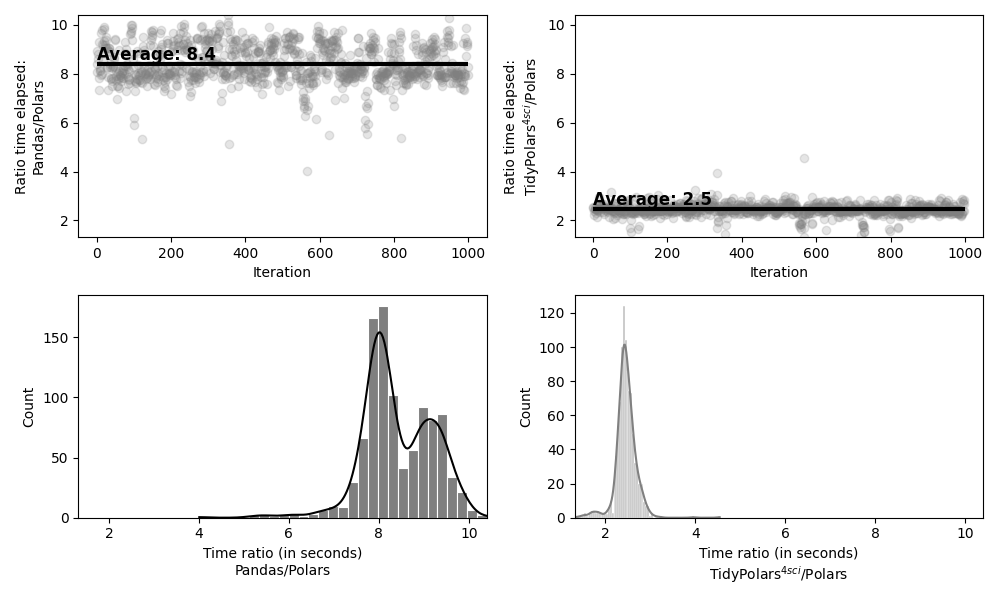

## Filter

``` {.python exports="both" results="output code" tangle="performance.py" cache="yes" noweb="no" session="*Python-Org*"}
import tidypolars4sci as tp
import pandas as pd
import polars as pl
import numpy as np
import time

num_rows = 20_000_000
df_tp = tp.tibble({'a':np.random.choice(['apple','banana','carrot',
                                    'date','eggplant'], num_rows), 
                 'b':np.random.rand(num_rows),
                 'c':np.random.rand(num_rows),
                 'd':np.random.rand(num_rows)})
df_pandas = df_tp.to_pandas()
df_polars = df_tp.to_polars()


processing_time = {'pandas': [],
                   'polars': [],
                   'tidypolars4sci': [],
                   }

# pandas 
# ------
start_time = time.time()
for _ in range(10):
    df_pandas.query("a=='apple' | a=='banana'")
    processing_time['pandas'] += [time.time() - start_time]

# polars 
# ------
start_time = time.time()
for _ in range(10):
    df_polars.filter((pl.col('a')=='apple') | (pl.col('a')=='banana'))
    processing_time['polars'] += [time.time() - start_time]

# tidypolars4si
# -------------
start_time = time.time()
for _ in range(10):
    df_tp.filter((tp.col('a')=='apple') | (tp.col('a')=='banana'))
    processing_time['tidypolars4sci'] += [time.time() - start_time]


# summary
summary=tp.tibble(processing_time)
summary.descriptive_statistics().arrange('Mean').print()


```

``` python
shape: (3, 10)
┌───────────────────────────────────────────────────────────────────────────────────────────┐
│ Variable           N   Missing (%)   Mean   Std.Dev.    Min    25%    50%     75%     Max │
│ str              i64           f64    f64        f64    f64    f64    f64     f64     f64 │
╞═══════════════════════════════════════════════════════════════════════════════════════════╡
│ tidypolars4sci    10          0.00   1.06       0.59   0.20   0.57   1.15    1.54    1.93 │
│ polars            10          0.00   1.07       0.59   0.19   0.57   1.16    1.55    1.94 │
│ pandas            10          0.00   7.25       3.84   1.40   4.09   7.97   10.49   12.76 │
└───────────────────────────────────────────────────────────────────────────────────────────┘
```

## Pivot wide

Let us use the data set `mtcars` to create a table in wide format using
`pivot_wide`. Here are the variables

``` {.python exports="both" results="output code" tangle="performance.py" cache="yes" noweb="no" session="*Python-Org*"}
import tidypolars4sci as tp
from tidypolars4sci.data import mtcars

mtcars.glimpse()
```

``` python
Columns matching pattern '.':
 Var Type     Uniq Miss (%) Head                                                       
name <object>   32    0 0% ['Mazda RX4' 'Mazda RX4 Wag' 'Datsun 710' 'Hornet 4 Drive'
...
 mpg <float64>  25    0 0% [21.  21.  22.8 21.4 18.7 18.1 14.3 24.4 22.8 19.2 17.8 16....
 cyl <int64>     3    0 0% [6 6 4 6 8 6 8 4 4 6 6 8 8 8 8 8 8 4 4 4 4 8 8 8 8 4 4 4 8 ...
disp <float64>  27    0 0% [160.  160.  108.  258.  360.  225.  360.  146.7 140.8 167....
  hp <int64>    22    0 0% [110 110  93 110 175 105 245  62  95 123 123 180 180 180 20...
drat <float64>  22    0 0% [3.9  3.9  3.85 3.08 3.15 2.76 3.21 3.69 3.92 3.92 3.92 3.0...
  wt <float64>  29    0 0% [2.62  2.875 2.32  3.215 3.44  3.46  3.57  3.19  3.15  3.44...
qsec <float64>  30    0 0% [16.46 17.02 18.61 19.44 17.02 20.22 15.84 20.   22.9  18.3...
  vs <int64>     2    0 0% [0 0 1 1 0 1 0 1 1 1 1 0 0 0 0 0 0 1 1 1 1 0 0 0 0 1 0 1 0 ...
  am <int64>     2    0 0% [1 1 1 0 0 0 0 0 0 0 0 0 0 0 0 0 0 1 1 1 0 0 0 0 0 1 1 1 1 ...
gear <int64>     3    0 0% [4 4 4 3 3 3 3 4 4 4 4 3 3 3 3 3 3 4 4 4 3 3 3 3 3 4 5 5 5 ...
carb <int64>     6    0 0% [4 4 1 1 2 1 4 2 2 4 4 3 3 3 4 4 4 1 2 1 1 2 2 4 2 1 2 2 4 ...

[Rows: 32; Columns 12]
```

A simple pivot wide operation:

``` {.python exports="both" results="output code" tangle="pivot-wide.py" cache="yes" noweb="no" session="*Python-Org*"}
from tidypolars4sci.data import mtcars

tab = (mtcars
       .select('name', 'am')
       .pivot_wider(values_from='name', names_from='am')
       )
print(tab)
```

``` python
shape: (1, 2)
┌─────────────────┐
│ 1        0      │
│ str      str    │
╞═════════════════╡
│ Mazda…   Horne… │
└─────────────────┘
```

Table below shows summary after 1,000 repetitions comparing the same
operation in Pandas, Polars, and tidypolars4sci:

``` python
shape: (3, 6)
┌───────────────────────────────────────────────────────────────────────────────────────────────┐
│ Mpdule           Mean (sec)   SD (sec)   Min (sec)   Max (sec)   How much slower than polars? │
│ str                     f64        f64         f64         f64   str                          │
╞═══════════════════════════════════════════════════════════════════════════════════════════════╡
│ Polars              0.00031    0.00005     0.00025     0.00092   1.0x (baseline)              │
│ TidyPolars4sci      0.00076    0.00007     0.00065     0.00184   2.4x                         │
│ Pandas              0.00261    0.00018     0.00250     0.00492   8.3x                         │
└───────────────────────────────────────────────────────────────────────────────────────────────┘
```

Here is the summary of the performance:


